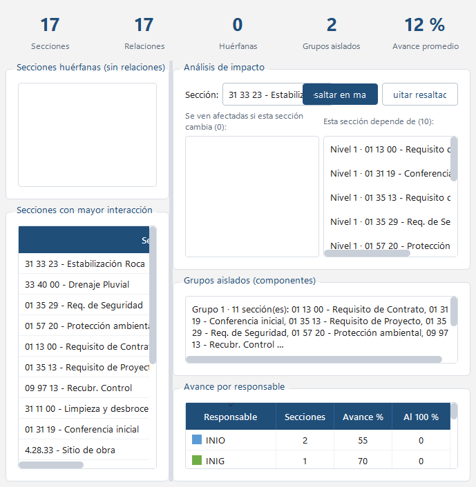

# Análisis e impacto

La pestaña **Análisis** resume el estado de la red de referencias.

## Indicadores

- **Secciones** y **Relaciones** del proyecto.
- **Huérfanas**: secciones sin ninguna relación. Doble clic centra la sección en el mapa.
- **Grupos aislados**: conjuntos de secciones conectadas entre sí pero no con el resto. Útil para detectar
  contenido que podría consolidarse.
- **Avance promedio** de todas las secciones y **avance por responsable**.

## Secciones con mayor interacción

Tabla ordenable con cuántas secciones referencia cada una (*Ref. a →*), por cuántas es referenciada
(*← Ref. por*) y el total. Las de mayor total son las que más coordinación requieren.

## Análisis de impacto

1. Elija una sección en la lista (o clic derecho en un nodo → *Analizar impacto*).
2. **Se ven afectadas si esta sección cambia**: las secciones que la referencian, directa (nivel 1) o
   indirectamente (niveles 2, 3, …).
3. **Esta sección depende de**: las secciones a las que ella hace referencia.
4. **Resaltar en mapa** atenúa todo lo que no participa y marca la sección elegida; **Quitar resaltado**
   restaura. La vista 3D también refleja el resaltado.

Regla usada: si «A hace referencia a B» y B cambia, entonces A se ve afectada.
