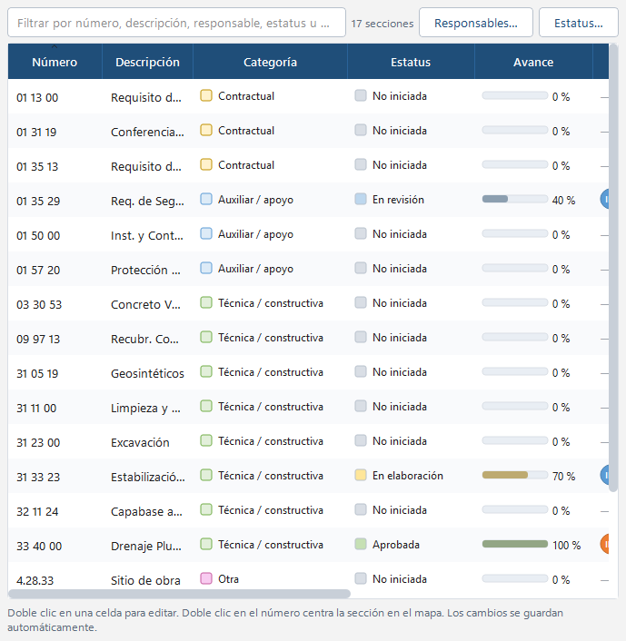

# Estatus, avance y responsables

Cada sección del proyecto tiene **estatus**, **porcentaje de avance**, **responsables** (unidades como INIO,
INIG, INIE, INI-PY, INIC) y **observaciones**.

## Cómo se ve en el mapa

- Sobre el nodo: una **píldora de color por responsable** con su código.
- Debajo del nodo: la **barra de avance** con el porcentaje, coloreada con el color del estatus, y el nombre
  del estatus.
- *Ver → Mostrar avance y responsables* (**F6**) los oculta para obtener un mapa limpio, por ejemplo al
  exportar.

## Dónde se editan

- **Doble clic en el nodo**: estatus, avance (deslizador), responsables (casillas) y observaciones.
- **Clic derecho en el nodo**: submenús *Estatus*, *Responsables* y *Avance* (0, 25, 50, 75, 100 u otro).
- **Pestaña Secciones**: todas las secciones en una tabla. Doble clic en una celda para editarla; filtre
  por texto y ordene por cualquier columna. Doble clic en el número centra la sección en el mapa.

## Listas configurables

- **Edición → Responsables…** (también en la barra): agregar, editar código, nombre y color, eliminar (avisa
  cuántas secciones lo usan) y reordenar con ▲▼. Use códigos cortos para que se lean en las píldoras.
- **Edición → Estatus…**: nombres, colores y cuál es el estatus por defecto para secciones nuevas.

Los proyectos nuevos incluyen los responsables INIO, INIG, INIE, INI-PY, INIC y los estatus *No iniciada*,
*En elaboración*, *En revisión*, *Aprobada* y *Emitida*. Estas listas viven dentro del archivo del proyecto.

## Análisis y tablas

La pestaña **Análisis** muestra el avance promedio y una tabla de avance por responsable. Las tablas de
Excel/CSV (ver *Exportar e importar*) incluyen estas columnas.
