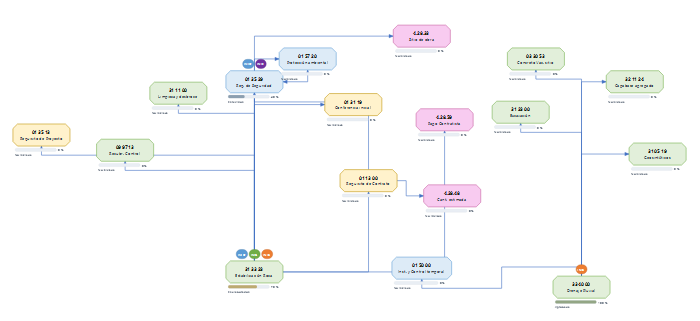
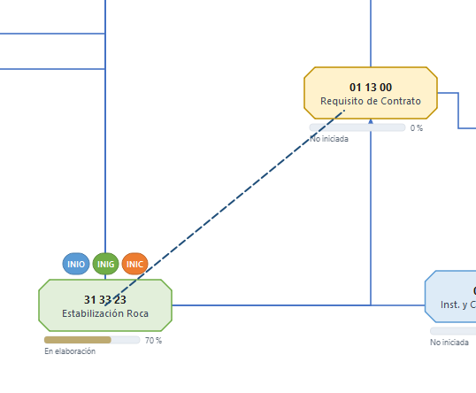

# Mapa de referencias

El mapa es un **lienzo libre**: cada sección es un nodo octogonal, cada cláusula del pliego un rectángulo
redondeado rosado y cada relación una flecha. Usted decide dónde va cada nodo; la aplicación nunca reacomoda lo
que ya movió.

## Moverse por el mapa

| Acción | Cómo |
|---|---|
| Mover un nodo | Arrástrelo. Las flechas lo siguen. |
| Mover varios | Dibuje un rectángulo sobre el fondo para seleccionarlos y arrastre. Flechas del teclado mueven 1 px (Shift: 10 px). |
| Zoom | Rueda del mouse. **Ctrl+0** ajusta todo a la vista, **Ctrl+1** vuelve al 100 %. |
| Desplazar la vista | Arrastre con el **botón central** o mantenga **Espacio** y arrastre. |
| Rejilla | *Ajustar a rejilla* alinea los nodos al soltarlos (vea abajo); *Ver → Mostrar rejilla* muestra u oculta las líneas de fondo. |
| Saltos en cruces | *Ver → Saltos en cruces de flechas*: donde una flecha cruza a otra, el tramo horizontal dibuja un pequeño arco sobre el vertical. Desactívelo si prefiere líneas planas. |

## Ajustar a rejilla: para qué sirve

El fondo del mapa tiene una cuadrícula. Con **Ajustar a rejilla** activado (botón de la barra o
*Ver → Ajustar a rejilla*), cada vez que suelta un nodo su posición se redondea al punto de cuadrícula
más cercano (pasos de 10 píxeles). El efecto práctico:

- Los nodos que usted acomoda en una fila o columna quedan **exactamente alineados**, sin desfases de uno
  o dos píxeles.
- Las flechas entre nodos alineados salen **rectas**, sin escalones pequeños.
- Es más fácil mantener un diagrama ordenado a medida que crece.

Con la opción desactivada el nodo queda exactamente donde lo suelta. La rejilla no mueve nodos por sí sola:
solo actúa sobre el nodo que usted está arrastrando, al soltarlo. Puede activarla o desactivarla en cualquier
momento; la preferencia no altera las posiciones ya guardadas. *Mostrar rejilla* solo controla si las líneas
de fondo se ven; no afecta el ajuste.

## Conectar: crear relaciones en el mapa

1. Pulse **Conectar** en la barra (o la tecla **C**). El cursor cambia a una cruz.
2. Haga clic sobre la sección de origen y **arrastre** hasta la sección de destino. Verá una línea punteada.
3. Suelte sobre el destino: aparece un menú con los tres tipos de relación. Elija uno.
4. La relación se agrega a la tabla y se dibuja la flecha. **Esc** cancela un arrastre o sale del modo.

Sin activar el modo: mantenga **Alt** y arrastre desde un nodo. El clic derecho en un nodo también
ofrece *Crear relación desde aquí*. Mientras el modo Conectar está activo los nodos no se mueven.

## Las flechas

- Salen por **arriba o por la derecha** del nodo origen y entran por **abajo o por la izquierda** del destino,
  con tramos horizontales y verticales. Así se distingue quién referencia a quién.
- Si el espacio no lo permite, la aplicación ajusta el punto de conexión.
- **Doble clic sobre una flecha** agrega un punto de quiebre que puede arrastrar. Doble clic sobre el punto lo
  quita. Clic derecho → *Restablecer ruta automática* borra los puntos; *Puerto de salida / entrada* fija el
  lado por el que la flecha sale o entra.
- Clic derecho → **Estilo de la flecha** cambia el color, el trazo (continua, discontinua, punteada, punto y
  raya) y el grosor; con varias flechas seleccionadas se aplica a todas. Vea *Relaciones*.
- Las flechas pueden cruzarse: la aplicación no lo impide, usted decide el trazado. Para que el cruce se lea,
  el **tramo horizontal dibuja un pequeño salto** (arco) sobre el vertical, como en Visio o draw.io; el salto se
  ve también en los PNG/SVG exportados y se desactiva en *Ver → Saltos en cruces de flechas*.

## Menú contextual del nodo (clic derecho)

Editar sección, Categoría, Color de la sección, Estatus, Responsables, Avance, Crear relación desde aquí,
Analizar impacto, Eliminar sección (elimina también sus relaciones, con confirmación).

## Menú del fondo (clic derecho en vacío)

Nueva sección aquí, Ajustar a la vista, Organizar secciones no acomodadas (solo las que usted nunca movió),
Exportar.
