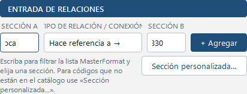
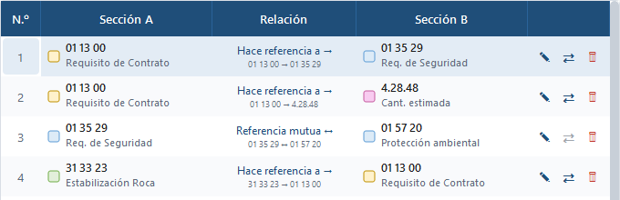

# Relaciones

Una relación une dos secciones e indica **quién hace referencia a quién**. Se registra en la entrada de la
izquierda o directamente en el mapa con *Conectar*.

## Los tres tipos

| Usted elige | Significa | Se dibuja |
|---|---|---|
| **Hace referencia a →** | A menciona a B (A → B) | flecha de A hacia B |
| **← Es referenciada por** | B menciona a A (B → A) | flecha de B hacia A |
| **Referencia mutua ↔** | ambas se mencionan | flecha con punta en los dos extremos |

El tipo define el sentido sin importar en qué campo puso cada sección. Por eso
«33 40 00 ← Es referenciada por 31 23 00» se guarda y se muestra como «31 23 00 → 33 40 00».

## Registrar una relación

1. Elija **Sección A** de la lista (vea *Secciones y catálogo*).
2. Elija el **tipo**.
3. Elija **Sección B** y presione **Enter** o **Agregar**.

Si alguna sección no existía en el proyecto, se crea automáticamente con la clasificación del catálogo y
aparece en el mapa cerca de la otra.

## Relaciones duplicadas

Solo puede existir **una** relación entre dos secciones:

- Si repite la misma relación, la app avisa que ya existe.
- Si registra la **inversa** de una existente (A → B y luego B → A), la app propone convertirla en
  **mutua ↔**.
- Si una relación mutua ya existe, no se agrega otra.

## Invertir la dirección o cambiar el tipo

La fila de la tabla y la flecha del mapa muestran **siempre** la relación como *origen → destino*. Por eso, al
invertir, las columnas A y B se intercambian y la celda *Relación* sigue diciendo «Hace referencia a →»: el
cambio sí se aplicó (la barra de estado lo confirma con el antes y el después, y la fila se resalta un momento).

Tiene tres caminos:

1. **Icono ⇄ en la fila** (columna de acciones): invierte la dirección con un clic. Aparece atenuado en las
   relaciones mutuas, que no tienen dirección.
2. **Celda «Relación»**: un clic abre la lista con *Hace referencia a →*, *Referencia mutua ↔* e
   *Invertir dirección (B → A)*.
3. **En el mapa**: clic derecho sobre la flecha muestra la relación actual con sus números y las opciones
   *Invertir dirección*, *Convertir en referencia mutua* o, si es mutua, *Convertir en dirigida* en cualquiera
   de los dos sentidos. Con la flecha seleccionada, la tecla **R** también la invierte.

## Editar y eliminar

- En **Relaciones registradas**, doble clic en *Sección A* o *Sección B* permite cambiar la sección; la
  flecha se mueve al nuevo destino.
- El lápiz ✎ edita las secciones; el bote 🗑 elimina (con confirmación). También puede seleccionar filas y
  presionar **Supr**.
- En el mapa, clic derecho sobre una flecha: además de lo anterior, *Agregar punto de quiebre*, *Restablecer
  ruta*, *Puerto de salida / entrada* y *Eliminar relación*.
- Seleccionar una fila resalta la flecha en el mapa, y seleccionar una flecha o nodo resalta sus filas.
