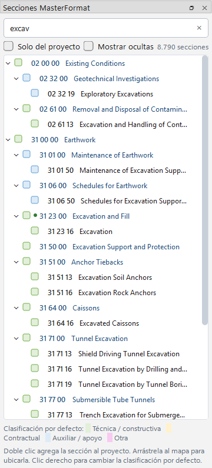

# Secciones y catálogo MasterFormat

La aplicación incluye el catálogo **MasterFormat 2020** (8.790 secciones). Las secciones del proyecto se
**eligen** de ese catálogo; no hay que escribirlas, lo que evita errores como `0330 00` en vez de `03 30 00`.

## Elegir una sección al registrar relaciones

1. En **Sección A** o **Sección B** escriba parte del número (`03 30`, `0330 00`, `033000`) o del título
   (`concrete`, `excav`). La lista se filtra mientras escribe.
2. Elija con el mouse o con las flechas y **Enter**. Si solo queda una coincidencia, Enter la toma.
3. El campo queda con fondo blanco cuando hay una elección válida y en ámbar si el texto no corresponde a
   ninguna sección. El texto libre **no** crea secciones.

Las secciones que ya están en el proyecto aparecen primero, con su color.

## El panel «Secciones MasterFormat» (F4)

- **Buscador**: filtra el árbol *División › nivel 2 › nivel 3 › nivel 4*.
- **Doble clic** en una sección: la agrega al proyecto. Si un campo de la entrada tiene el foco, también lo
  rellena.
- **Arrastrar al mapa**: crea la sección en el punto donde la suelte.
- **Clic derecho**: *Agregar al proyecto*, *Usar como Sección A / B*, *Centrar en el mapa*, cambiar la
  *Clasificación por defecto* y *Editar catálogo*.
- **Muestras**: la muestra de color indica la clasificación por defecto (verde técnica, amarillo contractual,
  azul auxiliar). El punto verde marca las secciones que ya están en el proyecto. «⚠» señala títulos que el
  catálogo trae incompletos.

## Cláusulas del pliego

Las cláusulas del pliego de cargos (`4.28.N` y subcláusulas `4.28.N.M`) están al final del árbol, bajo la raíz
**«Cláusulas 4.28»**, y también en el autocompletado. Son nodos rosados con esquinas redondeadas, sin estatus,
avance ni responsables. Vea el tema *Cláusulas del pliego*.

## Secciones que no están en MasterFormat

Para códigos propios del proyecto que tampoco sean cláusulas (por ejemplo `AX-01 Anexo`) use el botón
**Sección personalizada…** debajo de la entrada, o **Edición → Nueva sección…**. Si el número que escribió
coincide con una sección del catálogo, el cuadro le sugiere usarla.

## Editar el catálogo

Desde el clic derecho en el panel → *Editar catálogo*:

- **Editar título…** (inglés y español). El título en español, si existe, es el que se muestra.
- **Agregar sección hija…**: el padre y la clasificación se deducen del número.
- **Ocultar del catálogo**: deja de aparecer en la lista. La casilla *Mostrar ocultas* permite restaurarla.
- Estas ediciones se guardan en su perfil de usuario, valen para todos los proyectos y no cambian las
  secciones ya creadas. *Edición → Catálogo MasterFormat → Quitar todas las ediciones* las revierte.

Para cambios masivos: **Exportar catálogo a Excel…**, editar el archivo y cargarlo con
**Reemplazar catálogo MasterFormat…**. **Restaurar catálogo incluido** vuelve al original.

## Editar una sección del proyecto

Doble clic en el nodo del mapa (o clic derecho → *Editar sección…*) abre el cuadro con número, descripción,
categoría, color, estatus, avance, responsables y observaciones. La pestaña **Secciones** permite editar
esos mismos campos en una tabla.
